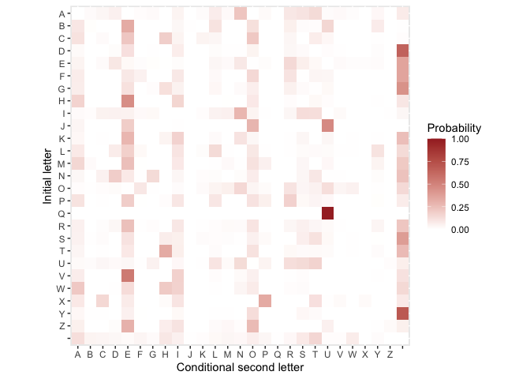

Decipher Encrypted Messages
================
Hugo Englund (rickyhugo)
9/9/2021

#### *Coded by Hugo Englund [(rickyhugo@github)](https://github.com/rickyhugo)*

## Introduction

In this notebook, I will perform a simple variation of Markov Chain
Monte Carlo (MCMC) simulation to decipher a hidden message – a
substitution cipher. Since the natural language is assumed to follow
certain rules and patterns, e.g., the probability of the letter ‘b’ to
precede ‘a’ is greater than the one for ‘x’. Hence, a sequence of
letters, a sentence, should satisfy the first order Markov properties.
Therefore, for a substitution cipher, we would like to find the unknown
function, the key, *f*, such that
*f* : {code space} → {usual alphabet}.
With this assumption and with inspiration from the ideas presented in
[The Markov Chain Monte Carlo
Revolution](https://statweb.stanford.edu/~cgates/PERSI/papers/MCMCRev.pdf),
I have successfully deciphered a hidden message from my university
lecturer.

### Fecth transition matrix

Firstly, we have to fetch the transition probability matrix. Usually,
one have to estimate this from scratch, but my lecturer had estimated
this matrix for the particular message he handed out.

``` r
# fetch and format transition matrix
trans = read.table('tran_prob.txt')
colnames(trans) = c(toupper(letters), " ")
rownames(trans) = c(toupper(letters), " ")
head(trans)
```

    ##              A            B            C            D            E            F
    ## A 3.912899e-05 1.680101e-02 3.409113e-02 5.522079e-02 0.0008265999 8.153503e-03
    ## B 9.317673e-02 6.686630e-03 1.162892e-04 4.942291e-04 0.3275867081 2.907230e-05
    ## C 1.101389e-01 1.647799e-05 1.697233e-02 1.647799e-04 0.2149883830 1.647799e-05
    ## D 2.052149e-02 1.103762e-04 9.339526e-05 1.100366e-02 0.1161667190 7.301811e-04
    ## E 4.244486e-02 7.378659e-04 1.681440e-02 9.102583e-02 0.0255985179 1.002348e-02
    ## F 7.068984e-02 5.134412e-04 1.833718e-05 1.833718e-05 0.0842226868 5.174753e-02
    ##              G            H          I            J            K          L
    ## A 1.693796e-02 1.540704e-03 0.04267016 8.265999e-04 0.0125457320 0.06921429
    ## B 2.907230e-05 5.814461e-05 0.02945024 5.087653e-03 0.0000290723 0.10500916
    ## C 1.647799e-05 1.843064e-01 0.04196945 1.647799e-05 0.0432052993 0.03269234
    ## D 3.684867e-03 4.330144e-04 0.06550404 2.012243e-03 0.0005943335 0.01051121
    ## E 6.861195e-03 2.283871e-03 0.01103605 2.747033e-04 0.0008784118 0.03296121
    ## F 1.833718e-05 7.334874e-05 0.08521289 1.833718e-05 0.0001466975 0.02218799
    ##              M            N            O            P            Q          R
    ## A 2.257743e-02 2.227075e-01 0.0002103183 2.078728e-02 1.467337e-05 0.08714515
    ## B 2.035061e-03 2.616507e-04 0.1178881879 2.907230e-05 2.907230e-05 0.05747594
    ## C 4.943398e-05 1.647799e-05 0.2096824691 1.647799e-05 1.944403e-03 0.03391171
    ## D 2.674501e-03 2.470729e-03 0.0444051996 4.245239e-05 3.905620e-04 0.03031950
    ## E 2.263747e-02 8.420616e-02 0.0051522847 1.086356e-02 7.825851e-04 0.13910530
    ## F 5.501155e-05 1.100231e-04 0.1465324385 1.833718e-05 1.833718e-05 0.10333003
    ##             S            T            U            V            W            X
    ## A 0.101867431 0.1368585291 0.0122913936 2.200517e-02 0.0104718956 2.152094e-04
    ## B 0.013809344 0.0073552926 0.1523970114 1.366398e-03 0.0006105184 2.907230e-05
    ## C 0.001598365 0.0654835467 0.0277159853 1.647799e-05 0.0001318239 1.647799e-05
    ## D 0.018891313 0.0004075429 0.0092970733 2.725443e-03 0.0003820715 8.490478e-06
    ## E 0.062354463 0.0245444237 0.0009997924 1.747241e-02 0.0101608292 9.956399e-03
    ## F 0.002750578 0.0394066087 0.0336303957 1.833718e-05 0.0005134412 1.833718e-05
    ##             Y            Z            
    ## A 0.026338701 1.878191e-03 0.075763504
    ## B 0.073494782 2.907230e-05 0.005436521
    ## C 0.005124656 9.886796e-05 0.009689060
    ## D 0.010018764 2.547143e-05 0.646575366
    ## E 0.012016674 6.069027e-04 0.358200374
    ## F 0.001540323 1.833718e-05 0.357171673

Just for fun, we can visualize the transition matrix to get a grasp of
what we are working with.

``` r
library(ggplot2)
library(reshape2)

# convert transition matrix from wide to long format (required for ggplot2)
trans_l = melt(as.matrix(trans))

ggplot(trans_l, aes(Var2, Var1)) + 
    geom_tile(aes(fill=value)) +
    scale_fill_gradient(low="white", high="brown", limits=c(0,1)) +
    labs(x="Conditional second letter", y="Initial letter", fill="Probability") +
    scale_y_discrete(limits = rev(levels(trans_l$Var1))) +
    coord_equal()
```

<!-- -->

### Log-likelihood calculation

Moving on, we need to keep track of the likelihood for the different
keys that will be generated. Since we work with quite small
probabilities, I decided to us the log-likelihood. This simplifies our
calculations and can also prevent zero division errors.

``` r
loglik = function(trans, txt) {
    # compute log-likelihood given transition probabilities
    dim = nchar(txt) - 1
    res = vector(mode="double", length=dim)
    for (i in 1:dim) {
        idx = strsplit(substring(txt, i, i+1), split="")[[1]]
        res[i] = log(trans[idx[1], idx[2]])
    }
    return(sum(res))
}
```

### Text decoding

Next, we need to “decode” the cipher as we generate new keys in order to
compute the log-likelihood and compare to the previous key.

``` r
transform_txt = function(base_key, key, txt) {
    # deciphers text with the current key
    transformed = txt
    for (i in 1:nchar(txt)) {
        substring(transformed, i, i) = base_key[key==substring(txt, i, i)]
    }
    return(transformed)
}
```

### Decipher algorithm

Now, we are able to compute the log-likelihood and to “decode” ciphers.
Then, we can implement the simple algorithm:

1.  Start with a preliminary guess, say *f*<sub>0</sub>.
2.  Compute the log-likelihood, ℒ(*f*<sub>0</sub>).
3.  For *t* = 1, 2, 3, …, change to *f*<sub>*t*</sub> by making a random
    transposition of the values *f*<sub>*t* − 1</sub> assigns to two
    symbols, i.e., switch places of two letters in the current key.
4.  Compute ℒ(*f*<sub>*t*</sub>); If this is greater than
    ℒ(*f*<sub>*t* − 1</sub>), accept *f*<sub>*t*</sub>.
5.  If not, generate a
    $u \\sim Bernoulli\\left(\\frac{\\mathcal{L}(f\_t)}{\\mathcal{L}(f\_{t-1})}\\right)$.
    If *u* = 1, go on with *f*<sub>*t*</sub>, otherwise keep
    *f*<sub>*t* − 1</sub>.

We do the fifth step to prevent getting stuck in a local maxima and then
miss the optimal key. Let’s code a little!

``` r
decipher = function(txt, trans, iter_lim=1e4, verbosity=500) {
    # base key for text transformation
    base_key = c(LETTERS, " ")
    
    # initial key
    init_key = base_key[sample(1:27)]
    init_txt = transform_txt(base_key, init_key, txt)
    init_loglik = loglik(trans, init_txt)
    
    prev_key = init_key
    prev_loglik = init_loglik
    
    # init counters
    max_loglik = -1e5
    iter = 0
    suc_cnt = 0
    while (iter <= iter_lim) {
        # next key - randomly switch two letters
        idx = sample(1:length(base_key), 2)
        next_key = replace(prev_key, idx, prev_key[c(idx[2], idx[1])])
        next_txt = transform_txt(base_key, next_key, txt)
        next_loglik = loglik(trans, next_txt)
        
        # compare to previous key
        if (next_loglik > prev_loglik) {
            # update when improved
            prev_loglik = next_loglik
            prev_key = next_key
        } else {
            p = exp(next_loglik - prev_loglik)
            if (rbinom(1, 1, p) == 1) {
                # update randomly
                prev_loglik = next_loglik
                prev_key = next_key
            }
        }
        
        # check for improvements
        if (next_loglik > max_loglik) {
            suc_cnt = suc_cnt + 1
            max_loglik = next_loglik
            max_txt = next_txt
            max_iter = iter
            max_improve = suc_cnt
        }
        
        # print current state
        if (iter %% verbosity == 0) {
            cat(
                "Iteration:", iter, "\n",
                "Succesful changes:", suc_cnt, "\n\n",
                "Message:\n", next_txt, "\n\n",
                "Current log-likelihood:", next_loglik, "\n",
                "Previous log-likelihood:", prev_loglik, "\n",
                "Maximum log-likelihood:", max_loglik, "\n",
                "----------------------------------------------------\n\n"
            )
        }
        # update total iterations
        iter = iter + 1
    }
    # print "optimal" state
    cat(
        "Obtained after iteration:", max_iter, "\n",
        "Succesful changes:", max_improve, "\n\n",
        "Deciphred message:\n", max_txt, "\n\n", 
        "Maximum log-likelihood:", max_loglik
    )
}
```

### Time to dechiper!

Let’s find out what the hidden message really is!

``` r
set.seed(20210909) # for reproducibility 
msg = "empenftpenjcjeumdfsmjbmusnmerbsmbsptnfjuhmsimemkstnmdjrrmutltvmgtmemcspkrtntmpenftpenjcjeumysmws mxusdmdfjcfmpenftpenjcjeumrtinmnfjbmieps bma sntmisvm bmkrtebtmbtuymws vmeubdtvmdjnfmws vmvmcsytbmgecxmnsmptmebmbssumebmksbbjgrtmnftmijvbnmsutmdjrrmdjumemivttmr ucf"

decipher(toupper(msg), trans)
```

    ## Iteration: 0 
    ##  Succesful changes: 1 
    ## 
    ##  Message:
    ##  ZCOZMPSOZMGAGZXCHPKCGICXKMCZFIKCIKOSMPGXJCKYCZCNKSMCHGFFCXS SRCQSCZCAKONFSMSCOZMPSOZMGAGZXCEKCLKVCWXKHCHPGAPCOZMPSOZMGAGZXCFSYMCMPGICYZOKVICBVKMSCYKRCVICNFSZISCISXECLKVRCZXIHSRCHGMPCLKVRCRCAKESICQZAWCMKCOSCZICIKKXCZICNKIIGQFSCMPSCYGRIMCKXSCHGFFCHGXCZCYRSSCFVXAP 
    ## 
    ##  Current log-likelihood: -1496.554 
    ##  Previous log-likelihood: -1496.554 
    ##  Maximum log-likelihood: -1496.554 
    ##  ----------------------------------------------------
    ## 
    ## Iteration: 500 
    ##  Succesful changes: 52 
    ## 
    ##  Message:
    ##  U AUMPEAUMISIUR WPT ID RTM ULDT DTAEMPIRG TY U FTEM WILL REZEN BE U STAFLEME AUMPEAUMISIUR CT HTK VRTW WPISP AUMPEAUMISIUR LEYM MPID YUATKD OKTME YTN KD FLEUDE DERC HTKN URDWEN WIMP HTKN N STCED BUSV MT AE UD DTTR UD FTDDIBLE MPE YINDM TRE WILL WIR U YNEE LKRSP 
    ## 
    ##  Current log-likelihood: -870.3748 
    ##  Previous log-likelihood: -796.7682 
    ##  Maximum log-likelihood: -796.7682 
    ##  ----------------------------------------------------
    ## 
    ## Iteration: 1000 
    ##  Succesful changes: 66 
    ## 
    ##  Message:
    ##  I QISTEQISAMAIN HTO AD NOS ILDO DOQESTANK OP I UOES HALL NEXER BE I MOQULESE QISTEQISAMAIN VO FOW YNOH HTAMT QISTEQISAMAIN LEPS STAD PIQOWD GWOSE POR WD ULEIDE DENV FOWR INDHER HAST FOWR R MOVED BIMY SO QE ID DOON ID UODDABLE STE PARDS ONE HALL HAN I PREE LWNMT 
    ## 
    ##  Current log-likelihood: -796.9367 
    ##  Previous log-likelihood: -720.7428 
    ##  Maximum log-likelihood: -720.7428 
    ##  ----------------------------------------------------
    ## 
    ## Iteration: 1500 
    ##  Succesful changes: 76 
    ## 
    ##  Message:
    ##  IPMISHEMISATAINP HOPADPNOSPILDOPDOMESHANYPOVPIPBOESP ALLPNEXERPFEPIPTOMBLESEPMISHEMISATAINPGOPCOUPWNO P HATHPMISHEMISATAINPLEVSPSHADPVIMOUDPKUOSEPVORPUDPBLEIDEPDENGPCOURPIND ERP ASHPCOURPRPTOGEDPFITWPSOPMEPIDPDOONPIDPBODDAFLEPSHEPVARDSPONEP ALLP ANPIPVREEPLUNTH 
    ## 
    ##  Current log-likelihood: -1007.751 
    ##  Previous log-likelihood: -677.9803 
    ##  Maximum log-likelihood: -677.885 
    ##  ----------------------------------------------------
    ## 
    ## Iteration: 2000 
    ##  Succesful changes: 86 
    ## 
    ##  Message:
    ##  I MITHEMITAWAIN SHO AD NOT ILDO DOMETHANG OF I BOET SALL NEVER PE I WOMBLETE MITHEMITAWAIN KO COU YNOS SHAWH MITHEMITAWAIN LEFT THAD FIMOUD JUOTE FOR UD BLEIDE DENK COUR INDSER SATH COUR R WOKED PIWY TO ME ID DOON ID BODDAPLE THE FARDT ONE SALL SAN I FREE LUNWH 
    ## 
    ##  Current log-likelihood: -665.9793 
    ##  Previous log-likelihood: -647.2528 
    ##  Maximum log-likelihood: -647.2528 
    ##  ----------------------------------------------------
    ## 
    ## Iteration: 2500 
    ##  Succesful changes: 92 
    ## 
    ##  Message:
    ##  A MATUEMATIGIAN WUO IS NOT ALSO SOMETUINK OF A POET WILL NEVER CE A GOMPLETE MATUEMATIGIAN DO BOH YNOW WUIGU MATUEMATIGIAN LEFT TUIS FAMOHS JHOTE FOR HS PLEASE SEND BOHR ANSWER WITU BOHR R GODES CAGY TO ME AS SOON AS POSSICLE TUE FIRST ONE WILL WIN A FREE LHNGU 
    ## 
    ##  Current log-likelihood: -731.5368 
    ##  Previous log-likelihood: -630.6421 
    ##  Maximum log-likelihood: -628.954 
    ##  ----------------------------------------------------
    ## 
    ## Iteration: 3000 
    ##  Succesful changes: 93 
    ## 
    ##  Message:
    ##  A MATOEMATICIAN WOH IS NHT ALSH SHMETOINK HF A BHET WILL NEVER GE A CHMBLETE MATOEMATICIAN DH PHU YNHW WOICO MATOEMATICIAN LEFT TOIS FAMHUS JUHTE FHR US BLEASE SEND PHUR ANSWER WITO PHUR R CHDES GACY TH ME AS SHHN AS BHSSIGLE TOE FIRST HNE WILL WIN A FREE LUNCO 
    ## 
    ##  Current log-likelihood: -772.3595 
    ##  Previous log-likelihood: -627.2532 
    ##  Maximum log-likelihood: -627.2532 
    ##  ----------------------------------------------------
    ## 
    ## Iteration: 3500 
    ##  Succesful changes: 95 
    ## 
    ##  Message:
    ##  A MATHEMATICIAN WHO IS NOT ALSO SOMETHINY OF A POET WILL NEGER KE A COMPLETE MATHEMATICIAN DO BOU VNOW WHICH MATHEMATICIAN LEFT THIS FAMOUS JUOTE FOR US PLEASE SEND BOUR ANSWER WITH BOUR R CODES KACV TO ME AS SOON AS POSSIKLE THE FIRST ONE WILL WIN A FREE LUNCH 
    ## 
    ##  Current log-likelihood: -635.9537 
    ##  Previous log-likelihood: -623.872 
    ##  Maximum log-likelihood: -619.6985 
    ##  ----------------------------------------------------
    ## 
    ## Iteration: 4000 
    ##  Succesful changes: 95 
    ## 
    ##  Message:
    ##  A MATHEMATICIAN WHO IS NOT ALSO SOMETHINV OF A POET WILL NEZER GE A COMPLETE MATHEMATICIAN DO BOU KNOW WHICH MATHEMATICIAN LEFT THIS FAMOUS QUOTE FOR US PLEASE SEND BOUR ANSWER WITH BOUR R CODES GACK TO ME AS SOON AS POSSIGLE THE FIRST ONE WILL WIN A FREE LUNCH 
    ## 
    ##  Current log-likelihood: -625.866 
    ##  Previous log-likelihood: -622.6899 
    ##  Maximum log-likelihood: -619.6985 
    ##  ----------------------------------------------------
    ## 
    ## Iteration: 4500 
    ##  Succesful changes: 95 
    ## 
    ##  Message:
    ##  A MATHEMATICIAN WHO IS NOT ALSO SOMETHINY OF A POET WILL NEXER VE A COMPLETE MATHEMATICIAN DO BOU KNOW WHICH MATHEMATICIAN LEFT THIS FAMOUS QUOTE FOR US PLEASE SEND BOUR ANSWER WITH BOUR R CODES VACK TO ME AS SOON AS POSSIVLE THE FIRST ONE WILL WIN A FREE LUNCH 
    ## 
    ##  Current log-likelihood: -623.3154 
    ##  Previous log-likelihood: -623.3154 
    ##  Maximum log-likelihood: -619.6985 
    ##  ----------------------------------------------------
    ## 
    ## Iteration: 5000 
    ##  Succesful changes: 95 
    ## 
    ##  Message:
    ##  A MATHEMATICIAN WHO IY NOT ALYO YOMETHING OF A POET WILL NEXER VE A COMPLETE MATHEMATICIAN DO BOU KNOW WHICH MATHEMATICIAN LEFT THIY FAMOUY QUOTE FOR UY PLEAYE YEND BOUR ANYWER WITH BOUR R CODEY VACK TO ME AY YOON AY POYYIVLE THE FIRYT ONE WILL WIN A FREE LUNCH 
    ## 
    ##  Current log-likelihood: -671.3119 
    ##  Previous log-likelihood: -621.2701 
    ##  Maximum log-likelihood: -619.6985 
    ##  ----------------------------------------------------
    ## 
    ## Iteration: 5500 
    ##  Succesful changes: 95 
    ## 
    ##  Message:
    ##  A MATHEMATIQIAN WHO IS NOT ALSO SOMETHING OF A POET WILL NEYER VE A QOMPLETE MATHEMATIQIAN DO BOU KNOW WHIQH MATHEMATIQIAN LEFT THIS FAMOUS CUOTE FOR US PLEASE SEND BOUR ANSWER WITH BOUR R QODES VAQK TO ME AS SOON AS POSSIVLE THE FIRST ONE WILL WIN A FREE LUNQH 
    ## 
    ##  Current log-likelihood: -704.7842 
    ##  Previous log-likelihood: -621.3932 
    ##  Maximum log-likelihood: -619.6985 
    ##  ----------------------------------------------------
    ## 
    ## Iteration: 6000 
    ##  Succesful changes: 95 
    ## 
    ##  Message:
    ##  A MATHEMATICIAN WHO IS NOT ALSO SOMETHING OF A POET WILL NEXEQ VE A COMPLETE MATHEMATICIAN DO BOU KNOW WHICH MATHEMATICIAN LEFT THIS FAMOUS RUOTE FOQ US PLEASE SEND BOUQ ANSWEQ WITH BOUQ Q CODES VACK TO ME AS SOON AS POSSIVLE THE FIQST ONE WILL WIN A FQEE LUNCH 
    ## 
    ##  Current log-likelihood: -717.1465 
    ##  Previous log-likelihood: -621.2701 
    ##  Maximum log-likelihood: -619.6985 
    ##  ----------------------------------------------------
    ## 
    ## Iteration: 6500 
    ##  Succesful changes: 95 
    ## 
    ##  Message:
    ##  A MATHEMATICIAN WHO IS NOT ALSO SOMETHING OR A BOET WILL NEZEF VE A COMBLETE MATHEMATICIAN DO POU KNOW WHICH MATHEMATICIAN LERT THIS RAMOUS QUOTE ROF US BLEASE SEND POUF ANSWEF WITH POUF F CODES VACK TO ME AS SOON AS BOSSIVLE THE RIFST ONE WILL WIN A RFEE LUNCH 
    ## 
    ##  Current log-likelihood: -640.0702 
    ##  Previous log-likelihood: -623.7048 
    ##  Maximum log-likelihood: -619.6985 
    ##  ----------------------------------------------------
    ## 
    ## Iteration: 7000 
    ##  Succesful changes: 95 
    ## 
    ##  Message:
    ##  A MATHEMATICIAN WHO IS NOT ALSO SOMETHINY OF A POET WILL NEZER JE A COMPLETE MATHEMATICIAN GO BOU KNOW WHICH MATHEMATICIAN LEFT THIS FAMOUS QUOTE FOR US PLEASE SENG BOUR ANSWER WITH BOUR R COGES JACK TO ME AS SOON AS POSSIJLE THE FIRST ONE WILL WIN A FREE LUNCH 
    ## 
    ##  Current log-likelihood: -641.643 
    ##  Previous log-likelihood: -627.0972 
    ##  Maximum log-likelihood: -619.6985 
    ##  ----------------------------------------------------
    ## 
    ## Iteration: 7500 
    ##  Succesful changes: 95 
    ## 
    ##  Message:
    ##  A MATHEMATICIAN WHZ IS NZT ALSZ SZMETHIND ZF A BZET WILL NEOER VE A CZMBLETE MATHEMATICIAN GZ PZU KNZW WHICH MATHEMATICIAN LEFT THIS FAMZUS QUZTE FZR US BLEASE SENG PZUR ANSWER WITH PZUR R CZGES VACK TZ ME AS SZZN AS BZSSIVLE THE FIRST ZNE WILL WIN A FREE LUNCH 
    ## 
    ##  Current log-likelihood: -809.5697 
    ##  Previous log-likelihood: -625.3466 
    ##  Maximum log-likelihood: -619.6985 
    ##  ----------------------------------------------------
    ## 
    ## Iteration: 8000 
    ##  Succesful changes: 95 
    ## 
    ##  Message:
    ##  A MATHEMATICIAN WHO IS NOT ALSO SOMETHING OF A POET WILL NEYER VE A COMPLETE MATHEMATICIAN DO KOU BNOW WHICH MATHEMATICIAN LEFT THIS FAMOUS JUOTE FOR US PLEASE SEND KOUR ANSWER WITH KOUR R CODES VACB TO ME AS SOON AS POSSIVLE THE FIRST ONE WILL WIN A FREE LUNCH 
    ## 
    ##  Current log-likelihood: -647.453 
    ##  Previous log-likelihood: -621.9828 
    ##  Maximum log-likelihood: -619.6985 
    ##  ----------------------------------------------------
    ## 
    ## Iteration: 8500 
    ##  Succesful changes: 95 
    ## 
    ##  Message:
    ##  A MATHEMATICIAN WHO IU NOT ALUO UOMETHING OF A BOET WILL NEPER VE A COMBLETE MATHEMATICIAN DO YOS KNOW WHICH MATHEMATICIAN LEFT THIU FAMOSU QSOTE FOR SU BLEAUE UEND YOSR ANUWER WITH YOSR R CODEU VACK TO ME AU UOON AU BOUUIVLE THE FIRUT ONE WILL WIN A FREE LSNCH 
    ## 
    ##  Current log-likelihood: -716.8231 
    ##  Previous log-likelihood: -623.8019 
    ##  Maximum log-likelihood: -619.6985 
    ##  ----------------------------------------------------
    ## 
    ## Iteration: 9000 
    ##  Succesful changes: 95 
    ## 
    ##  Message:
    ##  A MATHEMATICIAN WHO IS NOT ALSO SOMETHIND OP A BOET WILL NEXER VE A COMBLETE MATHEMATICIAN GO FOU KNOW WHICH MATHEMATICIAN LEPT THIS PAMOUS ZUOTE POR US BLEASE SENG FOUR ANSWER WITH FOUR R COGES VACK TO ME AS SOON AS BOSSIVLE THE PIRST ONE WILL WIN A PREE LUNCH 
    ## 
    ##  Current log-likelihood: -630.7424 
    ##  Previous log-likelihood: -626.2417 
    ##  Maximum log-likelihood: -619.6985 
    ##  ----------------------------------------------------
    ## 
    ## Iteration: 9500 
    ##  Succesful changes: 97 
    ## 
    ##  Message:
    ##  A MATHEMATICIAN WHO IS NOT ALSO SOMETHING OF A POET WILL NEQER BE A COMPLETE MATHEMATICIAN DO YOU KNOW WHICH MATHEMATICIAN LEFT THIS FAMOUS JUOTE FOR US PLEASE SEND YOUR ANSWER WITH YOUR R CODES BACK TO ME AS SOON AS POSSIBLE THE FIRST ONE WILL WIN A FREE LUNCH 
    ## 
    ##  Current log-likelihood: -628.2281 
    ##  Previous log-likelihood: -617.9753 
    ##  Maximum log-likelihood: -617.9753 
    ##  ----------------------------------------------------
    ## 
    ## Iteration: 10000 
    ##  Succesful changes: 98 
    ## 
    ##  Message:
    ##  A MATHEMATICIAN WHO IS NOT ALSO SOMETHING OF A POET WILL NEVER BE A COMPLETE MATHEMATICIAN UO JOD KNOW WHICH MATHEMATICIAN LEFT THIS FAMODS QDOTE FOR DS PLEASE SENU JODR ANSWER WITH JODR R COUES BACK TO ME AS SOON AS POSSIBLE THE FIRST ONE WILL WIN A FREE LDNCH 
    ## 
    ##  Current log-likelihood: -647.2397 
    ##  Previous log-likelihood: -619.1815 
    ##  Maximum log-likelihood: -617.3857 
    ##  ----------------------------------------------------
    ## 
    ## Obtained after iteration: 9763 
    ##  Succesful changes: 98 
    ## 
    ##  Deciphred message:
    ##  A MATHEMATICIAN WHO IS NOT ALSO SOMETHING OF A POET WILL NEVER BE A COMPLETE MATHEMATICIAN DO YOU KNOW WHICH MATHEMATICIAN LEFT THIS FAMOUS QUOTE FOR US PLEASE SEND YOUR ANSWER WITH YOUR R CODES BACK TO ME AS SOON AS POSSIBLE THE FIRST ONE WILL WIN A FREE LUNCH 
    ## 
    ##  Maximum log-likelihood: -617.3857
